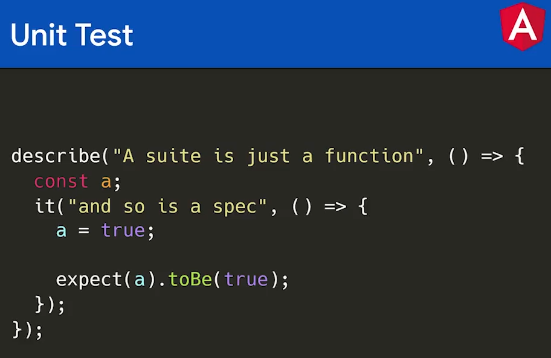
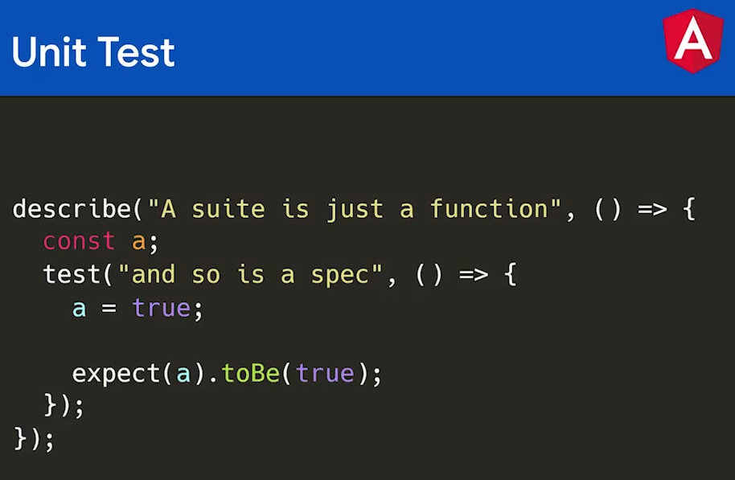
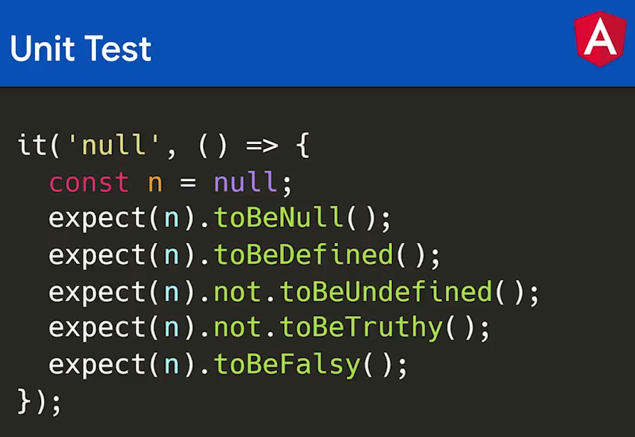

# Testing con Angular

Angular por defecto nos provee un ambiente de pruebas en base a **Jasmine** y **Karma**.

- **Jasmine**: Es un framework que vamos a utilizar para crear nuestros test unitarios.
- **Karma**: Es un ejecutor de pruebas para nuestros test.

Una de la ventaja del mundo de los test es que su estructura es muy similar entre los diferentes frameworks asi que el conocimiento adquirido en **Jasmine** tambien puede ser utilizado en **Jest**.

Ejemplo de un test en **Jasmine**



Ejemplo de un test en **Jest**



Como dato curioso una pequeña diferencia es que los **test** en **Jasmine** y **Jest** es que en **Jest** podemos usar **it** o **test** para crear nuestras pruebas unitarias mientras que Jasmine solo acepta **it**.

Otra cosa que tienen en común los diferentes frameworks son los matchers que son funciones que nos ayudan a hacer comprobaciones.



Al momento de hacer test con karma se debe tener en cuenta su archivo de configuración llamada **karma.config.js** el cual posee toda la configuración para correr nuestro test unitarios. Otra cosa a tener en cuenta es que karma va a ejecutar todos los archivos que terminen en **.spec.ts** ya que estos van a ser nuestros archivos de prueba.

Para ejecutar las pruebas debemos utilizar el siguiente comando:

```txt
ng test
```

## Componentes de una prueba

describe - Define una suite de tests. Una colección de tests. Recibe dos parámetros, un string con el nombre de la suite y una function() donde se definen los tests.

it - Define un test en particular. Recibe como parámetro el nombre del test y una función a ejecutar por el test.

expect - Lo que esperar recibir ese test. Con expect se hace la comprobación del test.

```ts
import { Calculator } from './calculator';

describe('Test for calculator', () => {
  it('#multiply should return nine', () => {
    // Arage || Preparar
    const calculator = new Calculator();
    // Act || actuar
    const rta = calculator.multiply(3, 3);
    // Asert || resolucion
    expect(rta).toBe(9);
  });
});
```

## Matchers

Recordemos que son funciones que nos ayudan a verificar un valor. Estos son algunos.

```ts
it('matchers', () => {
  let name = 'Julian';
  let name2;

  expect(name).toBeDefined();
  expect(name2).toBeUndefined();

  expect(1 + 3 === 4).toBeTrue(); // Solo tiene en cuenta el valor de true
  expect(1 + 3 === 4).toBeTruthy(); // Tiene en cuenta cualquier valor considerado verdadero
  expect(1 + 3 === 3).toBeFalse(); // Solo tiene en cuenta el valor de false
  expect(1 + 3 === 3).toBeFalsy(); // Tiene en cuenta cualquier valor considerado falso

  expect(5).toBeGreaterThan(2); // Mayor que
  expect(5).toBeGreaterThanOrEqual(2); // Mayor o igual que
  expect(5).toBeLessThan(10); // Menor que
  expect(5).toBeLessThanOrEqual(10); // Menor o igual que

  expect('123456').toMatch(/123/); // Para validar contra una expresión regular
  expect(['a', 'b', 'c']).toContain('a');
});
```

## Reporte de covertura

Es un repote que nos permite el porcetaje de codigo que esta cubierto por nuestras pruebas.

Para obtener este reporte usamos el siguiente comando:

```txt
ng test --no-watch --code-coverage
```

Algo a tener en cuenta es que este reporte puede ser algo engañoso ya que el va a tener en cuenta si cierta parte de codigo fue llamado no importa si fue desde una prueba o algo mas. Para ello es recomendable poder centrarse solamente en las pruebas que se estan generando, para ello podemos usar el fdescribe, xdescribe, fit o xit. Basicamente si un describe o it tiene un prefijo **f** significa que solo va a ejecutar esa suit o ese test ignorando los demas pero si tiene un prefijo **x** significa que va a ignorar esa suit o ese test.

## Reporter con Mocha

A partir de la versión 15 de angular el archivo **karma.config** viene oculto y para poderlo activar usamos el siguiente comando:

```txt
ng g config karma
```

Luego de su creación instalamos el siguiente paquete:

```txt
npm i karma-mocha-reporter --save-dev
```

Agregar en karma.conf.js en plugins

```txt
require('karma-mocha-reporter')
```

Cambiar reporters a:

```txt
reporters: ['mocha'],
```

Como opcional, si deseas ejecutar las pruebas sin necesidad de abrir un navegador cambia las siguiente opción:

```txt
browsers: ['ChromeHeadless'],
```

